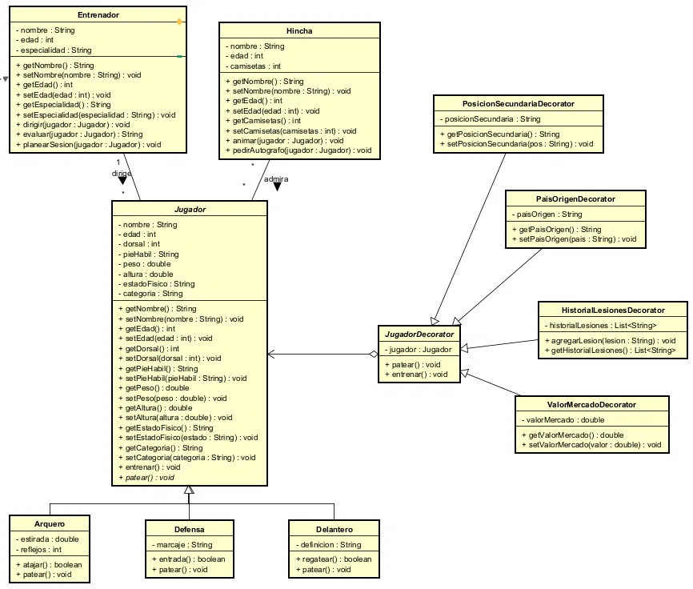

## 01. ¿Qué ventaja ofrece el polimorfismo en el diseño de clases frente al uso de múltiples condicionales para determinar el comportamiento de un objeto?

El polimorfismo permite que diferentes objetos respondan de manera distinta al mismo método. Esto evita tener muchos `if` o `switch` para determinar el comportamiento y hace que el código sea más flexible, limpio y fácil de mantener.

## 02. ¿Por qué una clase inmutable puede mejorar la seguridad en un sistema?

Una clase inmutable no permite modificar su estado después de crear el objeto. Esto mejora la seguridad porque evita cambios inesperados en los datos y hace que los objetos sean más predecibles y seguros de compartir.

## 03. ¿Qué problema podría aparecer en un sistema si los atributos de las clases se mantienen públicos en lugar de privados con getters y setters controlados?

Si los atributos son públicos, cualquier parte del programa puede modificarlos directamente, lo que puede generar datos inválidos o comportamientos inesperados. Usar atributos privados con getters y setters permite controlar cómo se accede y modifica la información.

## 04. Según el principio Abierto/Cerrado, ¿cómo deberíamos modificar el sistema si queremos añadir una nueva funcionalidad sin alterar el código existente?

Según el Principio Abierto/Cerrado, el sistema debe estar abierto para extensión, pero cerrado para modificación. Para agregar una funcionalidad, debemos crear nuevas clases o implementar nuevas interfaces sin modificar el código existente.

## 05. ¿Por qué es importante que una clase cumpla con el Principio de Única Responsabilidad? Da un ejemplo donde se vulnere.

Es importante porque permite que cada clase tenga una responsabilidad clara, haciendo que el código sea más fácil de entender, mantener y modificar. Por ejemplo, se viola este principio cuando una clase calcula el salario de un empleado y además se encarga de generar reportes, ya que tiene dos responsabilidades diferentes.

## 06. ¿Qué es y para qué usamos el pom.xml?

El archivo pom.xml es el archivo de configuración principal de un proyecto Maven. Allí se definen las dependencias, información del proyecto, plugins y otras configuraciones necesarias para construir y administrar el proyecto.

## 07. ¿Qué diferencia hay entre mvn compile, mvn package y mvn install?

* mvn compile: compila el código fuente del proyecto.
* mvn package: compila el proyecto y genera el paquete, por ejemplo un archivo .jar.
* mvn install: realiza el proceso de package y además instala el paquete en el repositorio local de Maven para que pueda ser utilizado por otros proyectos.

## 08. ¿Qué diferencia existe entre una interfaz y una clase abstracta?

Una interfaz define principalmente un contrato que las clases deben cumplir, mientras que una clase abstracta puede definir tanto métodos abstractos como métodos con implementación. Una clase puede implementar varias interfaces, pero solo puede heredar de una clase, sea abstracta o no.

## Reto 1 — La Boletería del Cine Astor

Sistema de boletería que permite armar una orden con boletas y confitería, aplicar el descuento según el tipo de espectador y generar la factura final.

Entrada esperada por línea de la orden: codigo cantidad (ej. boleta3d 2).
Códigos disponibles: `boleta2d`, `boleta3d`, `crispetas`, `gaseosa`. Se termina
escribiendo fin.

## Patrón de diseño utilizado

- **Categoría:** Comportamiento
- **Patrón:** **Strategy**
- **Justificación:** el cálculo del descuento depende del tipo de espectador
  (General 0%, Estudiante 15%, Tercera edad 25%) y ese algoritmo debe poder
  crecer (nuevos tipos de espectador) sin modificar la clase que arma la
  factura. Strategy encapsula cada algoritmo de descuento en su propia clase
  y permite intercambiarlos en tiempo de ejecución.
- **Cómo se aplicó:**
    - TipoEspectador (interfaz): declara el contrato calcularDescuento(subtotal).
    - EspectadorGeneral, Estudiante, TerceraEdad: estrategias concretas,
      cada una con su propio porcentaje.
    - Orden: el "contexto": recibe una `TipoEspectador` por constructor y le
      delega el cálculo, sin conocer los detalles de cada tipo.

Complementariamente se usó una jerarquía por herencia (Producto → Boleta,
ArticuloConfiteria) para representar los ítems del catálogo de forma
polimórfica y extensible.

## Principios SOLID aplicados

| Principio | Dónde | Cómo |
|-------|---|---|
| **SRP** | Orden, TipoEspectador, ItemOrden | Cada clase tiene una única responsabilidad: Orden coordina la orden, TipoEspectador calcula el descuento, ItemOrden calcula el subtotal de su línea. |
| **OCP** | TipoEspectador, Producto | Se pueden agregar nuevos tipos de espectador o nuevos productos creando nuevas subclases, sin modificar Orden. |
| **LSP** | Boleta/ArticuloConfiteria sobre Producto; cualquier TipoEspectador sobre la interfaz | Cualquier subtipo puede usarse donde se espera el tipo base sin romper el comportamiento de Orden. |
| **ISP** | TipoEspectador | Interfaz mínima con un solo método relevante (calcularDescuento), ningún cliente depende de métodos que no usa. |
| **DIP** | Orden | Depende de la abstracción TipoEspectador, no de una implementación concreta; la estrategia se inyecta por constructor. |

---

## Reto 2 — El Sastre a la Medida

- **Patrón de Diseño:** Creacional
- **Patrón Utilizado:** Builder
- **Justificación:** el sastre arma cada traje pieza por pieza según lo que el cliente elija, combinando piezas obligatorias (tela, saco, pantalón) y opcionales (chaleco, forro, bordado) de múltiples maneras. Un constructor tradicional requeriría demasiados parámetros opcionales o múltiples sobrecargas difíciles de mantener; el patrón Builder permite separar el proceso de construcción incremental del objeto final resultante, haciéndolo extensible, legible e inmutable.
- **Cómo lo aplicamos:**
    - Traje: clase que representa el producto final terminado e inmutable; almacena la lista de piezas y calcula el precio total usando Streams (mapToDouble().sum()).
    - PiezaTraje: modelo que encapsula los datos individuales de cada componente del traje (tipo, descripción y precio).
    - TrajeBuilder: clase constructora que expone métodos fluidos encadenables (conTela, conSaco, conPantalon, conChaleco, conForro, conBordado) fijando los precios según el catálogo y construyendo el Traje mediante el método construir().
    - SastreAMedida: clase principal interactiva que guía al usuario en la selección de piezas obligatorias y opcionales, delega la creación al builder y muestra el resumen final.

---

## Reto 3 — La Fábrica de Instrumentos

- **Patrón de Diseño:** Creacional
- **Patrón Utilizado:** Abstract Factory
- **Justificación:** el problema exige crear familias de objetos (instrumentos) que varían en dos dimensiones ortogonales: la familia tímbrica (cuerda, viento, percusión) y la gama de fabricación (Estudiante, Profesional, Vintage). Abstract Factory permite definir una interfaz de creación y proveer implementaciones concretas para cada gama, garantizando que todos los instrumentos fabricados por una misma fábrica sean coherentes entre sí (mismos materiales, afinación y factor de precio), sin acoplar el código de pedido a ninguna gama específica.
- **Cómo lo aplicamos:**
    - InstrumentoFactory: interfaz de fábrica abstracta con el método crearInstrumento(familia, modelo) que todas las fábricas concretas deben implementar.
    - FabricaEstudiante, FabricaProfesional, FabricaVintage: fábricas concretas que aplican el factor de precio y los materiales/afinación propios de cada gama al crear un Instrumento.
    - Instrumento: clase del producto final que almacena familia, modelo, gama, materiales, afinación y precio calculado.
    - CatalogoInstrumentos: repositorio de precios base por modelo; las fábricas concretas lo consultan para aplicar el factor de gama.
    - SelectorFabrica: clase utilitaria que, dado el texto de gama ingresado por el usuario, devuelve la fábrica concreta correspondiente.
    - PedidoArmoniaAndina: acumula los instrumentos creados y calcula el total usando Streams (mapToDouble().sum()); también imprime el resumen final.
    - FabricaDeInstrumentos: clase principal interactiva que guía al usuario para elegir cantidad, familia, modelo y gama de cada instrumento, delegando la creación a la fábrica seleccionada.

---
## Reto 4 — La Balanza Trucada del Mercado

- **Patrón de Diseño:** Creacional
- **Patrón Utilizado:** Fábrica Simple (Simple Factory)
- **Justificación:** al principio pensamos en Strategy, porque parecía que cada unidad necesitaba su propia forma de convertir. Pero al analizarlo bien nos dimos cuenta de que todas las conversiones son la misma operación matemática, multiplicar o dividir por un factor; lo único que cambia es ese número según la unidad. No hay comportamiento distinto que justifique una interfaz con varias implementaciones, así que optamos por una Fábrica Simple que centraliza esos factores en un solo lugar. Esto deja el sistema igual de extensible, agregar una unidad nueva es solo una entrada más en la tabla, pero sin la complejidad innecesaria de una jerarquía de estrategias.
- **Cómo lo aplicamos:**
    - FabricaUnidadPeso: centraliza la tabla de factores de conversión para gramo, libra, arroba y kilogramo, expresados como unidades por kilogramo. Expone obtenerFactor para obtener el factor de una unidad, esValida para verificar si una unidad existe y obtenerUnidadesDisponibles para apoyar la validación de las entradas del usuario.
    - ConversorPeso: ejecuta la conversión usando el kilogramo como punto de referencia intermedio. Primero convierte la cantidad de origen a kilogramos dividiendo por su factor, y luego a la unidad destino multiplicando por el factor correspondiente. Así se puede convertir entre cualquier par de unidades sin necesitar una fórmula distinta para cada combinación.
    - Pesaje: modelo inmutable que guarda un pesaje ya convertido: la cantidad original, la unidad de origen, la cantidad convertida, la unidad de destino y su equivalente en kilogramos, que se usa después para calcular el acumulado total.
    - FormateadorNumeros: separa el parseo y el formato de los números del resto de la lógica de negocio, manejando separador de miles con punto y decimales con coma.
    - BalanzaMercado: guía al usuario preguntando cuántos pesajes quiere calcular y, por cada uno, pide la cantidad, la unidad de origen y la unidad de destino de forma separada. Cada dato se valida antes de aceptarlo y se vuelve a preguntar si el usuario se equivoca. Al final usa Streams para sumar el equivalente en kilogramos de todos los pesajes y mostrar el total acumulado.

---

## Reto 5 — La Moto Personalizada

- **Patrón de Diseño:** Estructural
- **Patrón Utilizado:** Decorator
- **Justificación:** el enunciado pide que se puedan agregar accesorios, pinturas y complementos a una moto sin tocar la clase de la moto base, lo que es el Principio Abierto/Cerrado aplicado directamente. Pensamos en usar herencia para representar cada combinación de mejoras, pero eso generaría una subclase distinta por cada combinación posible, algo que crece sin control a medida que se agregan más accesorios. El patrón Decorator resuelve esto envolviendo la moto con cada mejora elegida, sumando su precio y descripción de forma dinámica y en cualquier cantidad u orden, sin que la moto base tenga que saber nada de accesorios, pinturas ni complementos.
- **Cómo lo aplicamos:**
    - MotoComponente: interfaz común que comparten tanto la moto base como cualquier moto que ya tenga mejoras aplicadas, con los métodos getDescripcion y getPrecio.
    - MotoBase: representa la moto sin ninguna mejora, con su modelo y su precio base.
    - MejoraDecorator: envuelve un MotoComponente, ya sea la moto base o una moto que ya tiene mejoras, y le suma el nombre y el precio de una mejora nueva. Como delega en el objeto que envuelve, las mejoras se pueden apilar una tras otra sin límite.
    - MejoraCatalogo y CatalogoMejoras: guardan el catálogo de mejoras disponibles con su nombre y precio, separado por completo de la lógica de decoración. Agregar una mejora nueva al taller es simplemente sumar una entrada más al catálogo.
    - PersonalizadorMoto: arma la cadena de decoradores. Por cada mejora que el cliente elige, envuelve la moto actual en un nuevo MejoraDecorator, y usa Streams para calcular cuánto suman las mejoras aparte del precio base.
    - TallerTurboAndes: guía al cliente pidiendo el modelo y precio base de la moto, muestra el catálogo numerado, arma la cadena de decoradores según lo que el cliente vaya eligiendo y al final imprime el resumen con la descripción completa, también construida con Streams, y el precio total.
---

## Reto 6 — Sala de Urgencias

- **Patrón de Diseño:** Comportamiento
- **Patrón Utilizado:** Chain of Responsibility
- **Justificación:** el flujo de atención médica requiere que una solicitud (el paciente con síntoma, gravedad y prioridad) sea evaluada secuencialmente por una serie de profesionales con distintas competencias. Cada profesional analiza si puede resolver el caso; si no está capacitado, delega la responsabilidad al siguiente eslabón de la cadena de forma desacoplada, hasta llegar al final donde se marca como remitido a otra institución si ningún profesional pudo atenderlo.
- **Cómo lo aplicamos:**
    - ProfesionalSalud: clase abstracta base (Handler) que define el contrato procesar(paciente), el enlace al siguiente profesional (siguiente) y la lógica para delegar al siguiente en la cadena.
    - Enfermero: manejador concreto que atiende pacientes de nivel Leve y prioridad máxima Baja (1). Si no puede atenderlo, lo pasa al siguiente.
    - MedicoGeneral: manejador concreto que atiende pacientes de nivel Moderado y prioridad máxima Media (2). Si no puede atenderlo, lo pasa al siguiente.
    - Especialista: manejador concreto que atiende pacientes de nivel Grave y prioridad máxima Alta (3). Si no puede atenderlo, lo pasa al siguiente.
    - CadenaAtencion: configura y ensambla la secuencia de atención (Enfermero -> MedicoGeneral -> Especialista) y despacha a los pacientes.
    - Paciente: clase que representa la solicitud y almacena la información clínica (síntoma, nivel, prioridad) y el estado final de atención.
    - SalaUrgencias: clase principal que gestiona la interacción con el usuario, coordina la atención y calcula las estadísticas finales usando Streams.

---

## Reto 7 — El Rover Explorador de Marte

- **Patrón de Diseño:** Comportamiento
- **Patrón Utilizado:** Command
- **Justificación:** cada acción enviada al rover por los distintos operadores debe ser tratada como un objeto independiente parametrizable, con la capacidad de ser ejecutada, registrada en un historial cronológico para auditoría y deshecha (undo) de manera individual sin acoplar el controlador de misión a los subsistemas del rover.
- **Cómo lo aplicamos:**
    - Comando: interfaz base que declara el contrato para ejecutar(), deshacer(), consultar operador, módulo, descripción con parámetros y estado de reversión.
    - ComandoMotor, ComandoBrazo, ComandoCamara, ComandoTaladro: comandos concretos que encapsulan los parámetros (metros, segundos, profundidad, acción) y ejecutan o revierten la operación sobre su receptor correspondiente.
    - Motor, Brazo, Camara, Taladro: clases receptoras (Receivers) que implementan las acciones físicas de cada módulo del rover.
    - ControlRover: invocador (Invoker) que mantiene el historial de comandos ejecutados y gestiona la reversión de acciones individuales por su número de registro.
    - RoverExploradorMarte: clase principal que coordina la entrada interactiva de acciones y operadores, gestiona la opción de deshacer y muestra el historial final.

## Reto 8 — La Academia de Fútbol de los UML

- **Patrón de Diseño:** Estructural
- **Patrón Utilizado:** Decorator
- **Justificación:** no todos los jugadores necesitan los mismos atributos adicionales (posición secundaria, país de origen, historial de lesiones, valor de mercado), y estos datos pueden variar o crecer con el tiempo sin afectar a toda la jerarquía de jugadores. Usar herencia para representar cada combinación posible generaría una explosión de subclases (ArqueroConPaisOrigen, DelanteroConValorMercadoYLesiones, etc.). El Decorator permite añadir estas características de forma dinámica, en tiempo de ejecución, envolviendo un jugador existente sin modificar su clase ni las clases de sus posiciones, respetando además el principio de abierto/cerrado.
- **Cómo lo aplicamos:**
    - Jugador: clase abstracta que actúa como componente base; define los atributos y comportamiento comunes a toda posición (nombre, edad, dorsal, peso, altura, estado físico, categoría) y declara patear() como método abstracto para ser sobrescrito polimórficamente.
    - Arquero, Defensa, Delantero: componentes concretos que heredan de Jugador, sobrescriben patear() con su propia lógica y agregan atributos y métodos exclusivos de su posición (atajar(), entrada(), regatear()).
    - JugadorDecorator: decorador abstracto que también extiende Jugador; mantiene una referencia interna al objeto Jugador que envuelve y delega en él las llamadas a patear() y entrenar(), permitiendo que un jugador decorado siga comportándose como cualquier otro Jugador.
    - PosicionSecundariaDecorator, PaisOrigenDecorator, HistorialLesionesDecorator, ValorMercadoDecorator: decoradores concretos que extienden JugadorDecorator; cada uno agrega un único atributo dinámico con sus respectivos getters y setters, sin tocar la clase Jugador ni sus subclases de posición.
    - Entrenador: se asocia con Jugador (1 a muchos) para dirigir, evaluar y planear sesiones sobre cualquier jugador, decorado o no, gracias a que ambos comparten el mismo tipo base.
    - Hincha: se asocia con Jugador y con Entrenador (muchos a muchos) para animar, pedir autógrafos y publicar fotos, interactuando también de forma transparente con jugadores decorados.

